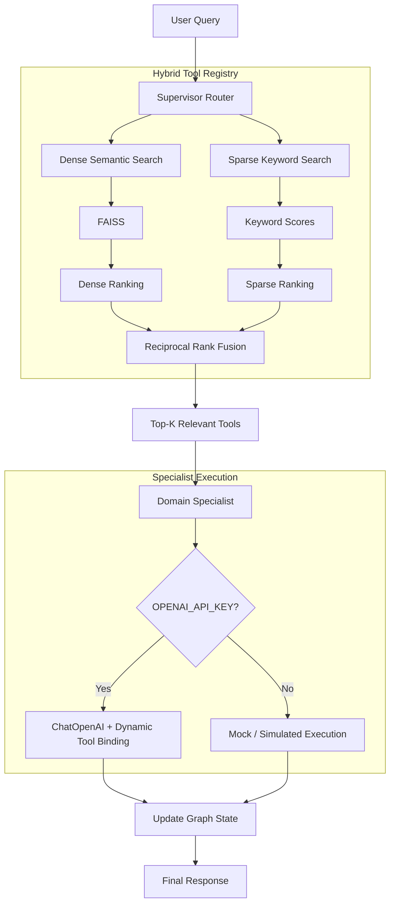

# Scalable Agentic System

A scalable agentic architecture designed to address the **tool explosion problem**: as an LLM gains access to hundreds or thousands of APIs, passing every tool schema directly into the model can increase context size, cost, latency, and tool-selection errors.

This project implements a **Hierarchical Supervisor-Specialist Agent Architecture with Dynamic Just-In-Time (JIT) Tool Retrieval**.

The core idea is simple:

```text
Large Tool Registry
        ↓
Supervisor Router
        ↓
Hybrid Tool Retrieval
        ↓
Top-K Relevant Tools
        ↓
Domain Specialist
        ↓
Dynamic Tool Binding
        ↓
Tool Execution
```

---

## 🎯 Problem

Consider an agent that has access to 50+ APIs, and eventually needs to scale to hundreds or thousands of tools.

A straightforward implementation exposes all tool schemas to the LLM:

```text
User Query
    ↓
LLM
    ↓
Hundreds / Thousands of Tool Schemas
    ↓
Tool Selection
    ↓
Execution
```

As the number of tools increases, the model has to reason over a much larger candidate space.

This can result in:

- Larger prompts and context usage
- Increased inference cost
- Higher latency
- Confusion between semantically similar tools
- Incorrect tool selection
- Incorrect or incomplete tool parameters

The goal of this project is to separate **tool discovery** from **tool execution**.

---

# 🏗️ Architecture



---

# 🚀 Key Features

## 1. Hierarchical Supervisor-Specialist Routing

The system separates **domain routing** from **tool execution**.

The Supervisor Router identifies the appropriate domain for the user's request.

Example domains include:

```text
invoicing
payments
disputes
analytics
rag
system
```

The request is then handled by a domain-focused specialist.

### Supervisor

The supervisor answers:

> **"Which domain should handle this request?"**

### Domain Specialist

The specialist answers:

> **"Given this domain and the retrieved tools, which tool should be used?"**

This separation prevents a single execution agent from having to reason over the complete system tool inventory.

---

# 🔎 2. Dynamic Just-In-Time Tool Retrieval

The complete tool registry is not passed to the LLM on every request.

Instead, the system retrieves a small set of relevant tools:

```text
All Available Tools
        ↓
Tool Registry
        ↓
Hybrid Retrieval
        ↓
RRF Ranking
        ↓
Top-K Tools
        ↓
Domain Specialist
```

Only the selected Top-K tools are dynamically bound to the specialist's context.

This is the primary mechanism used to address the tool-scaling problem.

---

# 🧠 3. Hybrid Dense + Sparse Retrieval

Tool retrieval combines two complementary approaches.

## Dense Semantic Retrieval

The implementation uses:

- `SentenceTransformers`
- `all-MiniLM-L6-v2`
- `FAISS`

The user query is converted into an embedding and compared against the tool embeddings.

This allows semantically similar tools to be retrieved even when the exact API name is not present in the query.

For example:

```text
"Can you check whether this customer has an open dispute?"
```

can retrieve:

```text
query_dispute_status
```

even when the exact tool name is not mentioned.

---

## Sparse Keyword Retrieval

The system also performs keyword-based matching against tool metadata.

This is useful for exact API terminology.

For example:

```text
"dispute status"
```

can strongly match:

```text
query_dispute_status
```

Dense retrieval and keyword retrieval therefore complement each other.

---

# 🔀 4. Reciprocal Rank Fusion

The dense and sparse retrieval rankings are combined using **Reciprocal Rank Fusion (RRF)**.

The scoring formula is:

$$
RRF(d) =
\frac{1}{60 + rank_{dense}(d)}
+
\frac{1}{60 + rank_{sparse}(d)}
$$

The final ranking combines:

- Semantic similarity
- Keyword overlap
- Relative ranking from both retrieval methods

This provides a more balanced tool-selection mechanism than relying on only one retrieval strategy.

---

# ⚡ 5. Dynamic Tool Binding

After retrieval, only the most relevant tools are bound to the specialist agent.

For example:

```text
User:
"Send an invoice for $50 to the customer."

        ↓

Supervisor:
invoicing

        ↓

Hybrid Retrieval:

1. send_paypal_invoice
2. system_introspect_search

        ↓

Top-K Tools

send_paypal_invoice

        ↓

Invoicing Specialist

        ↓

Dynamic Tool Binding

        ↓

Tool Execution
```

The LLM therefore reasons over a small, focused set of tools instead of the complete registry.

---

# 🧩 RAG Pipeline Tool

The system includes a dedicated RAG capability:

```text
rag_knowledge_search
```

This tool is intended for knowledge/documentation-oriented requests.

Example:

```text
"What is the policy on maximum invoice limits for business accounts?"
```

The request can be routed to the `rag` domain and the RAG tool can be selected.

This separates **knowledge retrieval** from transactional API execution.

---

# 🔍 System Search / Introspection Tool

The system also provides a dedicated system search capability:

```text
system_introspect_search
```

This can be used when the user wants information about the system's available capabilities.

Example:

```text
"What tools are available for managing invoices?"
```

The request is routed to the `system` domain and the system introspection tool is retrieved.

---

# 💾 State Management

The agent workflow is implemented using **LangGraph**.

The graph state carries information required during execution, including:

- User query
- Messages
- Active domain
- Retrieved tools
- Execution state

The current implementation uses:

```python
MemorySaver
```

for LangGraph checkpointing.

This allows the graph to maintain execution state across conversational turns.

---

# 🛡️ Execution & Fallback

The production module supports two execution paths.

## OpenAI API Key Available

```text
User Query
    ↓
LangGraph
    ↓
ChatOpenAI
    ↓
Dynamic Tool Binding
    ↓
Tool Call
    ↓
Execution
```

## OpenAI API Key Not Available

```text
User Query
    ↓
LangGraph
    ↓
Domain Routing
    ↓
Mock / Simulated Execution
    ↓
Response
```

The mock path allows the architecture to be demonstrated and verified without making live API calls.

---

# 📁 Repository Structure

```text
Scalable-Agentic-System/
│
├── agent_system_production.py
│
├── agent_system_production_documentation.md
│
├── scalable_agentic_system_report.md
│
├── README.md
│
└── __pycache__/
```

### `agent_system_production.py`

Main production-oriented implementation containing:

- LangGraph orchestration
- Supervisor routing
- Domain specialist execution
- SentenceTransformers embeddings
- FAISS retrieval
- Sparse keyword matching
- RRF ranking
- Dynamic Top-K tool binding
- ChatOpenAI integration
- Mock execution fallback

### `agent_system_production_documentation.md`

Detailed documentation describing the production-oriented architecture and implementation.

### `scalable_agentic_system_report.md`

Project report covering the architecture, design decisions, tool retrieval strategy, framework choices, and verification.

### `README.md`

Project overview, architecture, setup and usage documentation.

> `__pycache__/` is generated by Python and is not part of the application logic.

---

# 🛠️ Getting Started

## Prerequisites

Python **3.9+**

Clone the repository:

```bash
git clone https://github.com/Danisk43/Scalable-Agentic-System.git
cd Scalable-Agentic-System
```

---

## Install Dependencies

Install the required packages:

```bash
pip install numpy sentence-transformers faiss-cpu langchain langchain-community langchain-openai langgraph pydantic
```

---

# 🔑 Configure OpenAI

OpenAI execution is optional.

### Windows PowerShell

```powershell
$env:OPENAI_API_KEY="your-api-key-here"
```

### Linux / macOS / Git Bash

```bash
export OPENAI_API_KEY="your-api-key-here"
```

If the API key is not configured, the system uses the simulated execution path.

---

# ▶️ Run the System

Run the production implementation:

```bash
python agent_system_production.py
```

The production pipeline performs:

```text
Query
  ↓
Supervisor Routing
  ↓
Dense Retrieval
  +
Sparse Retrieval
  ↓
RRF
  ↓
Top-K Tool Selection
  ↓
Specialist Agent
  ↓
Dynamic Tool Binding
  ↓
Execution
```

---

# 🧪 Verification Scenarios

The implementation verifies five representative scenarios from the task.

| Scenario      | Query                                           | Domain        | Retrieved Tool               |
| ------------- | ----------------------------------------------- | ------------- | ---------------------------- |
| Invoicing     | Send an invoice for $50 to client@example.com   | `invoicing` | `send_paypal_invoice`      |
| Analytics     | What was my total sales volume last month?      | `analytics` | `query_sales_volume`       |
| Dispute       | Is there a dispute open from user_123?          | `disputes`  | `query_dispute_status`     |
| System Search | What tools are available for managing invoices? | `system`    | `system_introspect_search` |
| RAG           | What is the policy on maximum invoice limits?   | `rag`       | `rag_knowledge_search`     |

---

# 📊 Example Execution

## Example 1 — Invoicing

### User

```text
Send an invoice for $50 to client@example.com
```

### Supervisor

```text
Domain → invoicing
```

### Retrieval

```text
Top candidate:
send_paypal_invoice
```

### Specialist

The invoicing specialist receives the dynamically retrieved tool and generates the appropriate tool call.

### Execution

With an OpenAI API key:

```text
ChatOpenAI
    ↓
Dynamic Tool Call
    ↓
send_paypal_invoice
```

Without an API key:

```text
Mock Domain Execution
    ↓
Simulated Result
```

---

## Example 2 — Analytics

```text
User:
What was my total sales volume last month?

Supervisor:
analytics

Retrieved:
query_sales_volume
```

---

## Example 3 — Disputes

```text
User:
Is there a dispute open from user_123?

Supervisor:
disputes

Retrieved:
query_dispute_status
```

---

## Example 4 — System Search

```text
User:
What tools are available for managing invoices?

Supervisor:
system

Retrieved:
system_introspect_search
```

---

## Example 5 — RAG

```text
User:
What is the policy on maximum invoice limits?

Supervisor:
rag

Retrieved:
rag_knowledge_search
```

---

# ⚖️ Design Trade-offs

## Dense Retrieval

### Advantages

- Understands semantic similarity
- Works when user wording differs from tool descriptions
- Useful for natural-language requests

### Limitations

- May not prioritize exact API terminology
- Requires embedding generation and an index

---

## Sparse Retrieval

### Advantages

- Good for exact API names
- Simple and fast
- Useful for domain-specific keywords

### Limitations

- Can miss semantically similar requests with different wording

---

## Hybrid Retrieval

Combining both approaches with RRF provides a balance between:

```text
Semantic Understanding
        +
Exact Keyword Matching
```

This is particularly useful for large tool registries where both natural-language descriptions and exact API names matter.

---

# 🧠 Why Supervisor + Specialist?

The two components have different responsibilities.

### Supervisor

```text
"What domain should handle this request?"
```

### Specialist

```text
"Given this domain and these retrieved tools,
which tool should be used?"
```

This allows the system to first narrow the problem by domain and then narrow it further using tool retrieval.

The specialist therefore works with a focused tool context instead of the entire tool registry.

---

# 🔮 Future Improvements

Potential extensions include:

- Human-in-the-loop approval for high-risk actions
- Persistent production checkpoint storage
- More advanced tool-ranking models
- Retrieval evaluation using Recall@K
- Tool argument evaluation
- Production observability
- Distributed tool registries
- More sophisticated domain routing
- Tool usage analytics

These are future improvements and are not represented as implemented functionality.

---

# 📌 Summary

The central idea of the project is:

> **Do not give the LLM every tool. Retrieve the tools it needs first.**

The complete workflow is:

```text
User Query
    ↓
Supervisor Router
    ↓
Hybrid Tool Retrieval
    ↓
Dense + Sparse Search
    ↓
RRF Ranking
    ↓
Top-K Tool Selection
    ↓
Domain Specialist
    ↓
Dynamic Tool Binding
    ↓
Tool Execution
    ↓
Response
```

By separating **tool discovery** from **tool execution**, the architecture provides a practical approach for building agents that can work with a growing number of APIs while keeping the active tool context focused.
