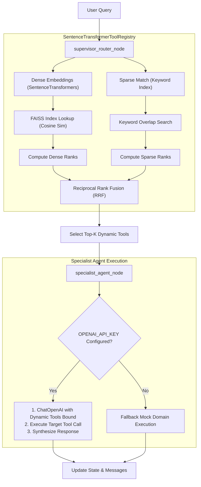

# Scalable Agentic System

A production-grade implementation of a **Hierarchical Supervisor-Specialist Agent Architecture** featuring **Dynamic Just-in-Time (JIT) Tool Retrieval**. This architecture addresses the "tool explosion" problem (where passing too many tool schemas directly to a Large Language Model degrades reasoning capabilities, increases context cost, and leads to parameter hallucination) by scaling to handle 5,000+ API tools dynamically.

---

## 🚀 Key Features

- **Hierarchical Routing**: A supervisor router node classifies queries into domain namespaces before binding tool execution.
- **Dynamic JIT Tool Retrieval**: Only the top-K relevant tool schemas are retrieved and bound to the specialist agent context on-the-fly.
- **Hybrid Dense-Sparse Indexing**: Combines dense semantic embeddings (using `SentenceTransformers` and `FAISS`) with sparse keyword matching.
- **Reciprocal Rank Fusion (RRF)**: Fuses ranking results from dense and sparse lookups to ensure high-precision tool discovery.
- **State Persistence**: Employs LangGraph's `MemorySaver` to checkpoint agent states across conversational turns.
- **Fail-safe Execution**: Real OpenAI tool-calling execution with fallback to high-fidelity mock payloads if API keys are missing.

---

## 📐 Architecture & Flow

### Production Information Flow

The workflow starts with a user query, goes through the supervisor router node to retrieve the optimal tools via hybrid dense-sparse lookup, and executes the selected domain specialist agent node:



---

## 📁 Repository Structure

- [`agent_system.py`](<file:///c:/Users/daniy/Desktop/Scalable%20Agentic%20System/agent_system.py>): Standalone prototype utilizing heuristic-based domain routing and keyword-overlap tool retrieval.
- [`agent_system_production.py`](<file:///c:/Users/daniy/Desktop/Scalable%20Agentic%20System/agent_system_production.py>): Production-ready module integrating SentenceTransformers, FAISS, and RRF retrieval alongside real OpenAI tool binding.
- [`test_agent_system.py`](<file:///c:/Users/daniy/Desktop/Scalable%20Agentic%20System/test_agent_system.py>): Verification test suite validating the prototype architecture.
- [`agent_system_documentation.md`](<file:///c:/Users/daniy/Desktop/Scalable%20Agentic%20System/agent_system_documentation.md>): Detailed architectural walkthrough of the prototype.
- [`agent_system_production_documentation.md`](<file:///c:/Users/daniy/Desktop/Scalable%20Agentic%20System/agent_system_production_documentation.md>): Deep-dive documentation of the production-grade pipeline.

---

## 🛠️ Getting Started

### 1. Prerequisites

Ensure you have Python 3.9+ installed.

### 2. Install Dependencies

Install the required packages using your package manager. Recommended packages:

```bash
pip install numpy sentence-transformers faiss-cpu langchain langchain-community langchain-openai langgraph pydantic
```

### 3. Setup Environment Variables (Optional)

For the production-grade module to call live LLMs, set your OpenAI API Key:

```powershell
# Windows PowerShell
$env:OPENAI_API_KEY="your-api-key-here"

# Linux / macOS / Git Bash
export OPENAI_API_KEY="your-api-key-here"
```

*Note: If no API key is detected, the system automatically falls back to simulated mock execution for testing.*

### 4. Running the System

To run the **Prototype** LangGraph execution and print its Mermaid configuration:

```bash
python agent_system.py
```

To run the **Production-Grade** dynamic semantic tool retrieval pipeline:

```bash
python agent_system_production.py
```

To execute the **Architecture Verification Test Suite**:

```bash
python test_agent_system.py
```

---

## 🧪 Verification Scenarios

The system is validated against 5 core integration tests representing common ecommerce and system administration requests:

| Test Scenario                | Query                                                   | Target Domain | Key Tool Retrieved           |
| :--------------------------- | :------------------------------------------------------ | :------------ | :--------------------------- |
| **Invoicing Action**   | *“Send an invoice for $50 to client@example.com”*   | `invoicing` | `send_paypal_invoice`      |
| **Analytics Query**    | *“What was my total sales volume last month?”*      | `analytics` | `query_sales_volume`       |
| **Dispute Lookup**     | *“Is there a dispute open from user_123?”*          | `disputes`  | `query_dispute_status`     |
| **System Search Tool** | *“What tools are available for managing invoices?”* | `system`    | `system_introspect_search` |
| **RAG Pipeline Tool**  | *“What is the policy on maximum invoice limits...”* | `rag`       | `rag_knowledge_search`     |
