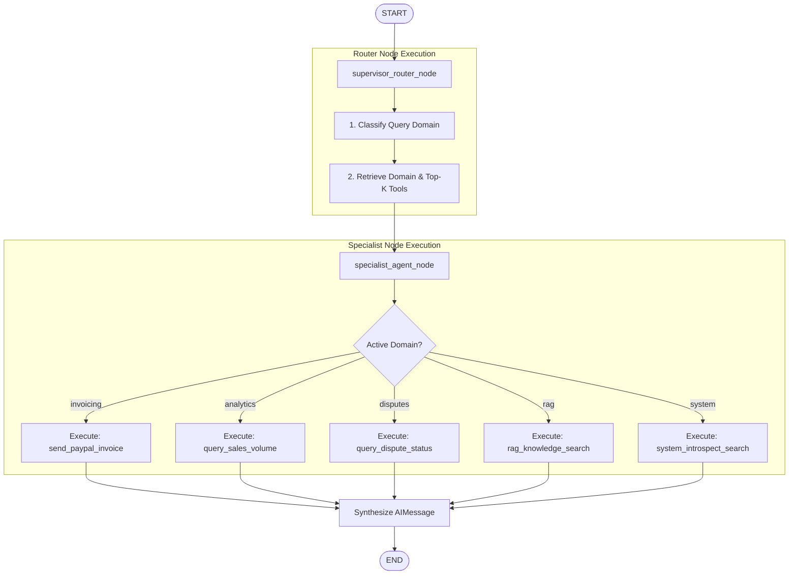

# Scalable Agentic System: Prototype Walkthrough & Code Documentation

This document provides a detailed, step-by-step code walkthrough of the scalable agentic system prototype defined in [`agent_system.py`](file:///c:/Users/daniy/Desktop/Datazoic/agent_system.py). 

The system implements a **Hierarchical Supervisor-Specialist Agent Architecture** with **Dynamic Just-in-Time Tool Retrieval**. This architecture addresses the "tool explosion" problem, where feeding too many tool schemas directly to an LLM degrades performance, increases cost, and causes parameter hallucination.

---

## 1. Architectural Flow Diagram

The following diagram illustrates the execution flow within the compiled LangGraph state machine:



---

## 2. Step-by-Step Code Walkthrough

### Step 1: Tool Micro-Manifest & Dynamic Tool Registry
*Code lines: 20–63*

To handle scaling to 5,000+ API tools, we avoid statically loading all tools into the LLM context. Instead, tools are registered using a **Tool Micro-Manifest** and retrieved dynamically at runtime.

#### A. `ToolManifest` Pydantic Model
This Pydantic model defines the schema of the metadata required to catalog a tool:
```python
class ToolManifest(BaseModel):
    tool_id: str
    domain: Literal["invoicing", "payments", "disputes", "analytics", "rag", "system"]
    name: str
    semantic_description: str
    keywords: List[str]
    is_dangerous: bool = False
    requires_hitl: bool = False
    parameters_schema: Dict[str, Any]
```
* **`tool_id`**: A unique catalog identifier.
* **`domain`**: The logical namespace of the tool (e.g., `invoicing`).
* **`semantic_description`**: A natural language description of what the tool does (used for semantic matching).
* **`keywords`**: Specific keywords to match exact terms (used for BM25/keyword indexing).
* **`is_dangerous` / `requires_hitl`**: Flags indicating if the tool modifies state or transfers funds, requiring Human-in-the-Loop approval.
* **`parameters_schema`**: A structural definition of the expected arguments.

#### B. `DynamicToolRegistry`
The registry maintains the map of manifest definitions and executable tools:
* **`register_tool`**: Maps a `ToolManifest` name to both its schema and its execution handle (inheriting from LangChain's `BaseTool`).
* **`retrieve_top_k`**: Implements a two-stage hybrid lookup query algorithm:
  1. **Domain Filter**: If a domain is specified, we filter out all tools outside this domain (except core `"system"` tools).
  2. **Hybrid Keyword + Semantic Scoring**:
     * Counts query word overlap against the tool's keywords (weighted at `2.0` per match).
     * Check if query terms are present in the semantic description (adds `1.5` per match).
  3. **Ranking**: Sorts candidates in descending order of their scores and returns the top-$K$ executable tools (default is $K=3$).

---

### Step 2: Graph State Definition
*Code lines: 68–75*

#### `AgentGraphState`
In LangGraph, state is passed between graph nodes as a single data structure.
```python
class AgentGraphState(BaseModel):
    messages: Annotated[Sequence[BaseMessage], add_messages] = Field(default_factory=list)
    active_domain: Optional[str] = None
    retrieved_tools: List[str] = Field(default_factory=list)
    pending_approval: bool = False
    execution_error: Optional[str] = None
    retry_count: int = 0
```
* **`messages`**: An annotated sequence of messages. The annotation `add_messages` acts as a **state reducer** in LangGraph. Instead of replacing the message list, new messages are merged and appended to the existing conversational history.
* **`active_domain`**: The categorized operational domain (e.g., `"invoicing"`, `"analytics"`).
* **`retrieved_tools`**: The list of tool names dynamically retrieved and bound to the agent context for the current turn.
* **`pending_approval`**: Flags whether a high-risk financial transaction is pending Human-in-the-Loop review.
* **`execution_error` / `retry_count`**: Used to track failures and control self-correction loops.

---

### Step 3: Simulated API and System Tools
*Code lines: 81–181*

The prototype defines five mock endpoints simulating real APIs. Each function returns serialized JSON results to emulate network payloads:
1. **`send_paypal_invoice`**: Simulates generating an invoice.
2. **`query_sales_volume`**: Simulates fetching analytical transaction records.
3. **`query_dispute_status`**: Simulates chargeback lookup.
4. **`rag_knowledge_search`**: Simulates checking the internal RAG base for policies/limits.
5. **`system_introspect_search`**: Simulates checking active system capabilities.

These tools are wrapped in LangChain `StructuredTool` instances and registered to the global `registry` alongside their respective `ToolManifest`s. For example:
```python
registry.register_tool(
    ToolManifest(
        tool_id="pp_send_inv_v2",
        domain="invoicing",
        name="send_paypal_invoice",
        semantic_description="Send a PayPal invoice to a customer email with designated amount",
        keywords=["invoice", "send", "bill", "collect", "pay"],
        parameters_schema={"invoice_id": "str", "recipient_email": "str", "amount": "float"}
    ),
    StructuredTool.from_function(send_paypal_invoice)
)
```

---

### Step 4: LangGraph Workflow Nodes
*Code lines: 187–239*

Nodes represent operational tasks in the state graph. They receive the current `AgentGraphState`, execute logic, and return a dictionary of state modifications.

#### A. `supervisor_router_node`
This node parses the user's intent to route the request to the correct domain.
```python
def supervisor_router_node(state: AgentGraphState) -> Dict[str, Any]:
    last_user_msg = [m.content for m in state.messages if isinstance(m, HumanMessage)][-1]
    query_lower = last_user_msg.lower()
    
    # Priority routing heuristic
    if any(w in query_lower for w in ["what tools", "available tools", "capabilities", "system status", "status of my"]):
        domain = "system"
    elif any(w in query_lower for w in ["policy", "documentation", "guide", "limit", "rules", "how to"]):
        domain = "rag"
    elif any(w in query_lower for w in ["invoice", "bill"]):
        domain = "invoicing"
    elif any(w in query_lower for w in ["sales", "volume", "revenue", "analytics"]):
        domain = "analytics"
    elif any(w in query_lower for w in ["dispute", "chargeback", "claim"]):
        domain = "disputes"
    else:
        domain = "rag"

    # Dynamic Retrieval: Query the registry for the Top-K relevant tools
    relevant_tools = registry.retrieve_top_k(query=last_user_msg, domain=domain, k=3)
    
    return {
        "active_domain": domain,
        "retrieved_tools": [t.name for t in relevant_tools]
    }
```
* **Input**: Current graph state.
* **Logic**: Classifies the query domain using keyword heuristics. It then queries the `registry` using the user message to find the Top-K relevant tools for that domain.
* **Output**: Updates the state keys `"active_domain"` and `"retrieved_tools"`.

#### B. `specialist_agent_node`
Once routing is determined, this node mimics the specialist agent processing the request with its dynamically bound tools.
```python
def specialist_agent_node(state: AgentGraphState) -> Dict[str, Any]:
    domain = state.active_domain
    last_user_msg = [m.content for m in state.messages if isinstance(m, HumanMessage)][-1]
    
    # Router mapping to simulated tool execution based on classified domain
    if domain == "system":
        tool_res = system_introspect_search(last_user_msg)
        ai_response = f"System Introspection Result: {tool_res}"
    elif domain == "rag":
        tool_res = rag_knowledge_search(last_user_msg)
        ai_response = f"RAG Grounded Knowledge: {tool_res}"
    # ... handles remaining domains invoicing, analytics, disputes ...
    
    return {
        "messages": [AIMessage(content=ai_response)]
    }
```
* **Input**: State containing `"active_domain"`.
* **Logic**: Simulates calling the appropriate tool dynamically bound to the domain and returning the response text.
* **Output**: Appends the final answer as an `AIMessage` to the state's `"messages"` key.

---

### Step 5: Graph Compilation & Persistence
*Code lines: 241–256*

#### `build_agent_graph`
This compiles the LangGraph state machine.
```python
def build_agent_graph():
    builder = StateGraph(AgentGraphState)
    
    # Add nodes to graph
    builder.add_node("supervisor_router", supervisor_router_node)
    builder.add_node("specialist_agent", specialist_agent_node)
    
    # Define execution edges
    builder.add_edge(START, "supervisor_router")
    builder.add_edge("supervisor_router", "specialist_agent")
    builder.add_edge("specialist_agent", END)
    
    # Enable persistence (checkpointer)
    checkpointer = MemorySaver()
    return builder.compile(checkpointer=checkpointer)
```
* **MemorySaver**: Uses an in-memory checkpoint database. This is a critical production feature of LangGraph that persists state between conversational turns. It allows the graph to resume execution, remember transaction history, and support pauses for Human-in-the-Loop interrupts.

---

### Step 6: Command Line Entrypoint
*Code lines: 258–267*

When executed directly (`python agent_system.py`), the script prints the visual Mermaid code representing the compiled graph:
```python
if __name__ == "__main__":
    try:
        mermaid_code = agent_system.get_graph().draw_mermaid()
        print("\n--- Compiled LangGraph Mermaid Diagram ---")
        print(mermaid_code)
        print("------------------------------------------\n")
```

---

## 3. Interaction Verification Test Suite

The test suite in [`test_agent_system.py`](file:///c:/Users/daniy/Desktop/Datazoic/test_agent_system.py) verifies the system against five target scenarios:

| Test Scenario | Sample Query | Expected Classified Domain | Expected Tool Retrieved |
| :--- | :--- | :--- | :--- |
| **Invoicing Action** | *"Send an invoice for $50 to..."* | `invoicing` | `send_paypal_invoice` |
| **Analytics Query** | *"What was my total sales volume last month?"* | `analytics` | `query_sales_volume` |
| **Dispute Lookup** | *"Is there a dispute open from user_123?"* | `disputes` | `query_dispute_status` |
| **System Search Tool** | *"What tools are available for managing invoices?"* | `system` | `system_introspect_search` |
| **RAG Pipeline Tool** | *"What is the policy on maximum invoice limits..."* | `rag` | `rag_knowledge_search` |

For each query, the script invokes the compiled graph using a unique thread ID:
```python
config = {"configurable": {"thread_id": f"thread_test_{idx}"}}
result = agent_system.invoke(
    {"messages": [HumanMessage(content=query)]},
    config=config
)
```
By using `thread_id`, the checkpointer tracks conversation states separately, preventing context leakage between isolated sessions.
