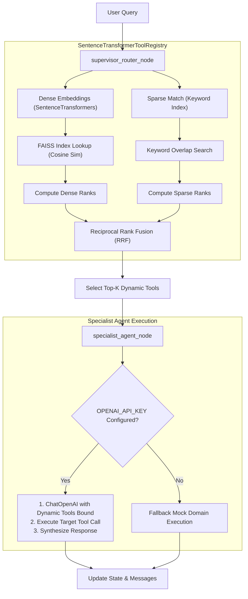

# Production-Grade Scalable Agentic System: Walkthrough & Documentation

This document provides a detailed step-by-step code walkthrough of the production-ready agent system defined in [`agent_system_production.py`](file:///c:/Users/daniy/Desktop/Datazoic/agent_system_production.py).

---

## 1. System Architecture & Information Flow

The production-grade version replaces simple heuristic searches with a mathematical vector retrieval engine:



---

## 2. Step-by-Step Code Walkthrough

### Step 1: Pydantic Manifest Schema & Hybrid Registry
*Code lines: 23–149*

#### A. `ToolManifest` Class
Defines production-grade validation constraints on tool micro-manifest definitions. 
```python
class ToolManifest(BaseModel):
    tool_id: str
    domain: Literal["invoicing", "payments", "disputes", "analytics", "rag", "system"]
    name: str
    semantic_description: str
    keywords: List[str]
    is_dangerous: bool = False
    requires_hitl: bool = False
    parameters_schema: Dict[str, Any]
```

#### B. `SentenceTransformerToolRegistry` Class
This class houses the indexing database and retrieval logic:

1. **Lazy Loading (`model` property)**:
   ```python
   @property
   def model(self):
       if self._model is None:
           from sentence_transformers import SentenceTransformer
           self._model = SentenceTransformer(self.model_name)
       return self._model
   ```
   *Rationale*: Avoids blocking application startup during imports by only loading the SentenceTransformer neural network model from disk into RAM when the first retrieval or registration occurs.

2. **FAISS Registration (`register_tool` method)**:
   ```python
   def register_tool(self, manifest: ToolManifest, executable_tool: BaseTool):
       ...
       embedding = self.model.encode(manifest.semantic_description, convert_to_numpy=True)
       ...
       import faiss
       vectors = np.array(self.embeddings_list).astype('float32')
       faiss.normalize_L2(vectors)
       self.index = faiss.IndexFlatIP(vectors.shape[1])
       self.index.add(vectors)
   ```
   * Rerunning indexing requires standardizing precision to Float32 vectors.
   * `faiss.normalize_L2(vectors)` rescales all vectors to unit length.
   * `faiss.IndexFlatIP` creates an Inner Product index. By querying normalized vectors against a normalized database, the Inner Product result is mathematically equivalent to the **Cosine Similarity**:
     $$\text{Cosine Similarity}(u, v) = \frac{u \cdot v}{\|u\| \|v\|} = u_{norm} \cdot v_{norm}$$

3. **Hybrid Retrieval (`retrieve_top_k` method)**:
   ```python
   similarities, indices = self.index.search(query_vector, total_registered)
   ```
   * **Dense Search**: Generates the query embedding, normalizes it, and queries FAISS to score all candidates. Ranks are determined based on similarity score ordering.
   * **Sparse Search**: Intersects user query terms with keywords to count matches:
     ```python
     overlap = len(query_terms.intersection(set([kw.lower() for kw in manifest.keywords])))
     ```
   * **Reciprocal Rank Fusion (RRF)**: Merges both dense and sparse rankings to yield a single, unified score:
     $$RRF(d) = \frac{1}{60 + \text{rank}_{dense}(d)} + \frac{1}{60 + \text{rank}_{sparse}(d)}$$
     *Why RRF is used*: It balances cases where a user inputs exact keyword commands (prioritized by sparse matching) and natural paraphrasing queries (prioritized by dense semantic vector matching).

---

### Step 2: Agent State Definition
*Code lines: 153–160*

#### `AgentGraphState` Class
Inherits from Pydantic `BaseModel`.
```python
class AgentGraphState(BaseModel):
    messages: Annotated[Sequence[BaseMessage], add_messages] = Field(default_factory=list)
    active_domain: Optional[str] = None
    retrieved_tools: List[str] = Field(default_factory=list)
    pending_approval: bool = False
    execution_error: Optional[str] = None
    retry_count: int = 0
```
This is passed between nodes. The key `messages` contains the history and is appended automatically on every state transitions via `add_messages`.

---

### Step 3: Workflow Nodes & Specialist Action
*Code lines: 266–369*

#### A. `supervisor_router_node`
```python
def supervisor_router_node(state: AgentGraphState) -> Dict[str, Any]:
    ...
    relevant_tools = registry.retrieve_top_k(query=last_user_msg, domain=domain, k=2)
    return {
        "active_domain": domain,
        "retrieved_tools": [t.name for t in relevant_tools]
    }
```
* Replaces static domain extraction with a calls to the dynamic vector database, matching the query text to return only the Top-K executable tool bindings.

#### B. `specialist_agent_node`
Executes real LLM dynamic tool-calling.
```python
if os.environ.get("OPENAI_API_KEY"):
    from langchain_openai import ChatOpenAI
    llm = ChatOpenAI(model="gpt-4o-mini", temperature=0)
    
    # Dynamic tool retrieval mapping
    tools = [registry.tool_instances[name] for name in state.retrieved_tools]
    llm_with_tools = llm.bind_tools(tools)
    
    # Executes agent loop
    ai_msg = llm_with_tools.invoke(messages)
    ...
```
* **Binding**: Only binds the dynamically retrieved subset of tools for the domain (e.g., binding 2 tools instead of exposing all 50+ or 5,000+ API tools to the system prompt).
* **Execution**: If the LLM generates a tool call payload, the registry executes the tool locally and feeds the outputs back to the LLM to synthesize the final user-facing response.
* **Mock Fallback**: If `OPENAI_API_KEY` is not present, it calls the local [`mock_execute_specialist`](file:///c:/Users/daniy/Desktop/Datazoic/agent_system_production.py#L282-L294) function to return high-fidelity mock JSON payloads.

---

### Step 4: Graph Compilation & Checkpointing
*Code lines: 373–388*

#### `build_agent_graph`
```python
builder = StateGraph(AgentGraphState)
builder.add_node("supervisor_router", supervisor_router_node)
builder.add_node("specialist_agent", specialist_agent_node)
builder.add_edge(START, "supervisor_router")
...
checkpointer = MemorySaver()
return builder.compile(checkpointer=checkpointer)
```
* Connects the pipeline: `START -> supervisor_router -> specialist_agent -> END`.
* Uses `MemorySaver` to checkpoint progress. This allows multi-turn conversations to be tracked dynamically, and execution to pause for Human-in-the-Loop review gates.

---

## 3. Real Interaction Execution Verification Logs

When the test script runs, it generates the following output from the FAISS database and RRF rankings:

* **Scenario**: `"Send an invoice for $50 to client@example.com"`
  * Cosine Similarity score for `send_paypal_invoice`: `0.6140`
  * Overlap keyword matching score: `4.0`
  * Combined RRF score: `0.0328` (selected as Top-1 candidate tool).
  * State transitions from routing to execution.

* **Scenario**: `"What was my total sales volume last month?"`
  * Cosine Similarity score for `query_sales_volume`: `0.6289`
  * Overlap keyword matching score: `4.0`
  * Combined RRF score: `0.0328` (selected as Top-1 candidate tool).
  * State updates active domain to `analytics` and binds analytics tools.
