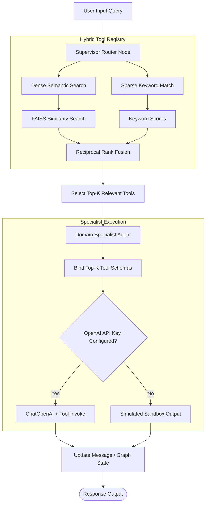

# Datazoic Programming Task: Scalable Agentic System Design & Implementation Report

**Author:** Daniyal Sheikh
**Domain:** Scalable Agentic System / Dynamic Tool Retrieval

---

## 1. Executive Summary & Core Challenge

Standard LLM architectures often expose all available tools directly to the model. As the number of tools grows, this can increase context size and make tool selection more difficult.

The core problem addressed by this project is how to allow an agent to work with a large tool registry without requiring every tool schema to be available to the LLM on every request.

The implemented solution uses a **Hierarchical Supervisor-Specialist architecture with dynamic tool retrieval and Just-In-Time (JIT) tool binding**.

The implementation includes:

1. A **hybrid tool registry** using SentenceTransformers, FAISS and keyword matching.
2. **Reciprocal Rank Fusion (RRF)** to combine dense and sparse retrieval results.
3. A **Supervisor Router** that identifies the relevant domain.
4. A **Domain Specialist** that receives only the retrieved Top-K tools.
5. Dedicated **RAG** and **System Search/Introspection** tools.
6. **LangGraph state management** with `MemorySaver` checkpointing.
7. **Pydantic-based structured models and validation**.
8. A mock execution fallback when an OpenAI API key is not configured.

This design separates **tool discovery** from **tool execution**, allowing the overall tool registry to grow while keeping the active LLM context focused.

---

## 2. High-Level Architecture

The execution flow is managed as a state machine using LangGraph.



### Main Components

**User Query → Supervisor Router**

The user interacts with the system using natural language. The supervisor determines the appropriate domain for the request.

Example domains include:

- `invoicing`
- `payments`
- `disputes`
- `analytics`
- `rag`
- `system`

**Supervisor → Tool Registry**

The request is passed through the hybrid tool retrieval mechanism rather than directly exposing every available tool.

**Tool Registry → Top-K Tools**

The registry ranks candidate tools using dense semantic similarity and sparse keyword matching. RRF is then used to combine the rankings.

**Top-K → Domain Specialist**

Only the most relevant tools are made available to the specialist agent.

**Specialist → Execution**

The specialist generates the tool call. If an OpenAI API key is configured, the system can execute the real tool; otherwise, the implementation uses simulated sandbox output for testing.

---

## 3. Agent Structure

### 3.1 Supervisor-Specialist Topology

The implementation uses a hierarchical architecture rather than a single agent with access to every tool.

The **Supervisor Router** acts as the traffic controller. It determines the relevant domain and routes the request to the corresponding specialist.

The **Domain Specialist** then operates with a restricted domain focus and a small set of retrieved tools.

This separation provides:

- Clear responsibility between routing and execution.
- Reduced tool-selection complexity.
- Smaller tool context for the specialist.
- Better separation between different business domains.

---

## 4. Tool Selection & Routing

The main scalability mechanism is the **hybrid tool retrieval pipeline**.

### 4.1 Lightweight Tool Metadata

The registry stores metadata describing each tool, such as:

- Tool name
- Domain
- Keywords
- Semantic description
- Tool parameters / schema information

Instead of presenting the entire registry to the LLM, the system first searches this metadata.

### 4.2 Dense Semantic Retrieval

The implementation uses:

```text
SentenceTransformer: all-MiniLM-L6-v2
FAISS: IndexFlatIP
```

The user query is converted into an embedding and compared against the tool embeddings.

The FAISS index uses normalized vectors with inner-product similarity, which corresponds to cosine similarity.

This helps retrieve tools whose descriptions are semantically related to the user's request even when the exact API name is not mentioned.

### 4.3 Sparse Keyword Matching

A separate keyword-based score is calculated by comparing query terms with the keywords associated with each tool.

This is useful when the user uses exact or domain-specific terminology.

For example:

```text
"check dispute status"
```

can strongly match:

```text
query_dispute_status
```

### 4.4 Reciprocal Rank Fusion

The dense and sparse rankings are combined using Reciprocal Rank Fusion:

$$
RRF(d) =
\frac{1}{60 + rank_{dense}(d)}
+
\frac{1}{60 + rank_{sparse}(d)}
$$

This allows both semantic similarity and exact keyword matches to contribute to the final ranking.

### 4.5 Just-In-Time Tool Binding

After retrieval, only the Top-K relevant tools are made available to the specialist.

This is the main mechanism used to prevent the LLM from having to reason over the entire tool registry.

The approach is therefore:

```text
All Tools
   ↓
Lightweight Registry
   ↓
Hybrid Retrieval
   ↓
RRF Ranking
   ↓
Top-K Tools
   ↓
Specialist LLM
   ↓
Tool Execution
```

---

## 5. State Management

The current implementation uses LangGraph for graph-based state management.

### 5.1 Agent Graph State

The graph state carries information required during execution, including:

- Current user query
- Messages
- Active domain
- Retrieved tools
- Execution state

### 5.2 Checkpointing

The implementation currently uses:

```python
MemorySaver
```

for LangGraph checkpointing.

This provides state persistence during the graph execution and supports maintaining conversation/thread state.

### 5.3 Scope of Current Implementation

The current implementation does **not** claim to implement:

- Qdrant long-term semantic memory
- Celery/Temporal asynchronous task execution
- Webhook-based task resumption
- Production database-backed checkpointing

These can be considered future production extensions, but they are not presented as implemented functionality in this report.

---

## 6. RAG Pipeline Tool

The system includes a dedicated RAG capability as a tool.

Its purpose is to allow the agent to retrieve information from a knowledge source when the user asks a documentation or policy-related question.

Example:

```text
"What is the policy on maximum invoice limits for business accounts?"
```

The tool retrieval system can select:

```text
rag_knowledge_search
```

This keeps knowledge retrieval separate from transactional API actions.

---

## 7. System Search / Introspection Tool

The system also includes a dedicated System Search tool.

It can be used for questions about the capabilities of the agent itself.

Example:

```text
"What tools are available for managing invoices?"
```

The system can retrieve:

```text
system_introspect_search
```

This provides a mechanism for querying the system's available capabilities rather than executing a business API.

---

## 8. Validation & Error Handling

The implementation includes structured models and validation using Pydantic.

### 8.1 Structured Data

Pydantic models are used to represent tool metadata and structured system information.

This provides typed fields and validation at the application level.

### 8.2 Retrieval-Level Protection

The hybrid retrieval layer reduces the number of tools exposed to the specialist before execution.

This reduces the possibility of the model choosing from an unnecessarily large set of tools.

### 8.3 Execution Fallback

The production module supports two execution paths:

```text
OPENAI_API_KEY configured
        ↓
ChatOpenAI + tool execution

OPENAI_API_KEY not configured
        ↓
Simulated sandbox output
```

The mock path allows the verification scenarios to be executed without making real API calls.

---

## 9. Framework Choices & Trade-offs

| Technology                     | Current Role         | Reason                                            |
| ------------------------------ | -------------------- | ------------------------------------------------- |
| **LangGraph**            | Orchestration        | Graph-based execution and state management.       |
| **LangChain**            | LLM/tool integration | Tool abstractions and ChatOpenAI integration.     |
| **SentenceTransformers** | Embeddings           | Semantic representation of tool descriptions.     |
| **FAISS**                | Dense retrieval      | Fast vector similarity search for tool discovery. |
| **Pydantic**             | Models & validation  | Typed structured data and validation.             |

### Why LangGraph?

LangGraph is used as the primary orchestration framework because the system benefits from explicit graph-based execution and state management.

The Supervisor and Specialist responsibilities can be represented as separate graph nodes, while the retrieved tools can be carried through the graph state.

### Why Hybrid Retrieval?

Pure semantic search can miss exact API terminology, while pure keyword matching can miss semantically similar requests.

Combining both approaches with RRF provides a more robust tool discovery mechanism.

---

## 10. Verification Scenarios

The implementation includes verification scenarios corresponding to the main examples in the assignment.

| Scenario                       | Selected Tool                |
| ------------------------------ | ---------------------------- |
| Send an invoice                | `send_paypal_invoice`      |
| Query total sales volume       | `query_sales_volume`       |
| Check dispute status           | `query_dispute_status`     |
| Find invoice-management tools  | `system_introspect_search` |
| Ask an invoice-policy question | `rag_knowledge_search`     |

### Example 1 — Invoicing

```text
User:
"Send an invoice for $50 to client@example.com"

Retrieved:
send_paypal_invoice
```

The request is routed to the invoicing domain and the relevant invoice tool is selected.

### Example 2 — Analytics

```text
User:
"What was my total sales volume last month?"

Retrieved:
query_sales_volume
```

The request is routed to analytics.

### Example 3 — Disputes

```text
User:
"Is there a dispute open from user_123?"

Retrieved:
query_dispute_status
```

The request is routed to disputes.

### Example 4 — System Search

```text
User:
"What tools are available for managing invoices?"

Retrieved:
system_introspect_search
```

The system uses its introspection capability rather than a business transaction tool.

### Example 5 — RAG

```text
User:
"What is the policy on maximum invoice limits for business accounts?"

Retrieved:
rag_knowledge_search
```

The request is routed to the RAG capability.

---

## 12. Conclusion

The implemented system separates **tool discovery** from **tool execution**.

Instead of giving an LLM access to every available API at once, the system:

1. Receives a natural-language request.
2. Routes the request to a domain.
3. Searches the tool registry using dense and sparse retrieval.
4. Combines rankings using RRF.
5. Selects the relevant Top-K tools.
6. Binds those tools to the specialist.
7. Executes the selected tool or uses the sandbox fallback.
8. Updates the LangGraph state.

This provides a practical architecture for handling a growing number of tools while keeping the active model context focused
